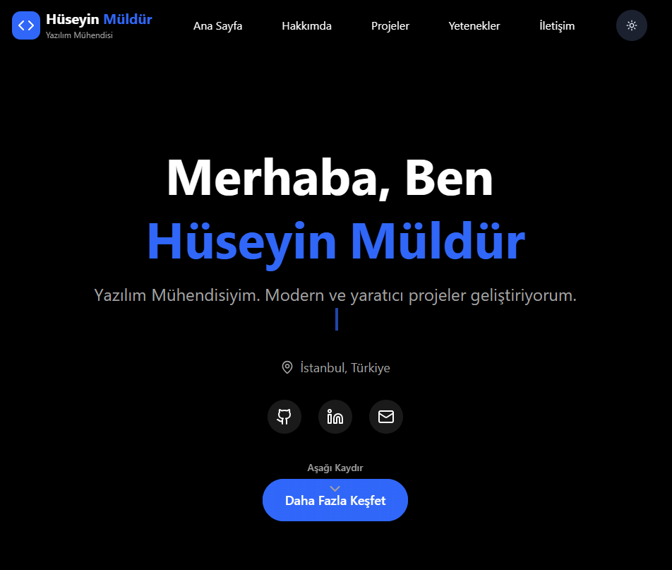
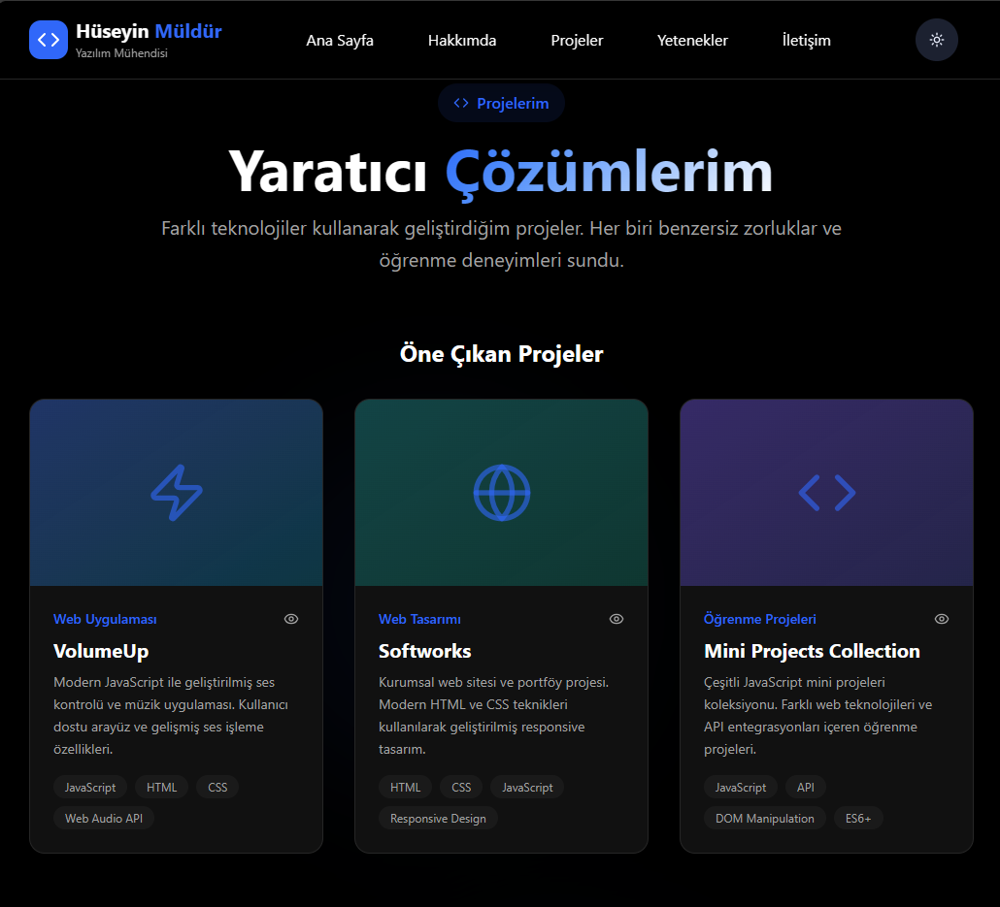
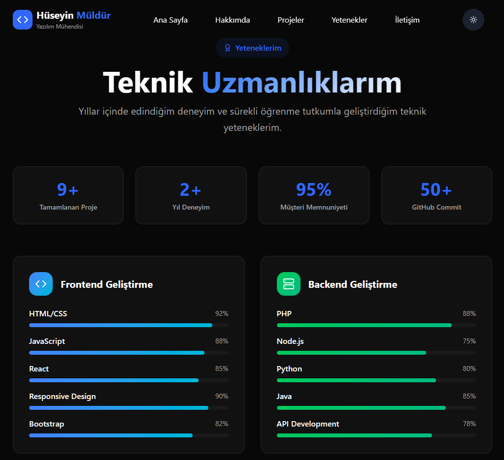
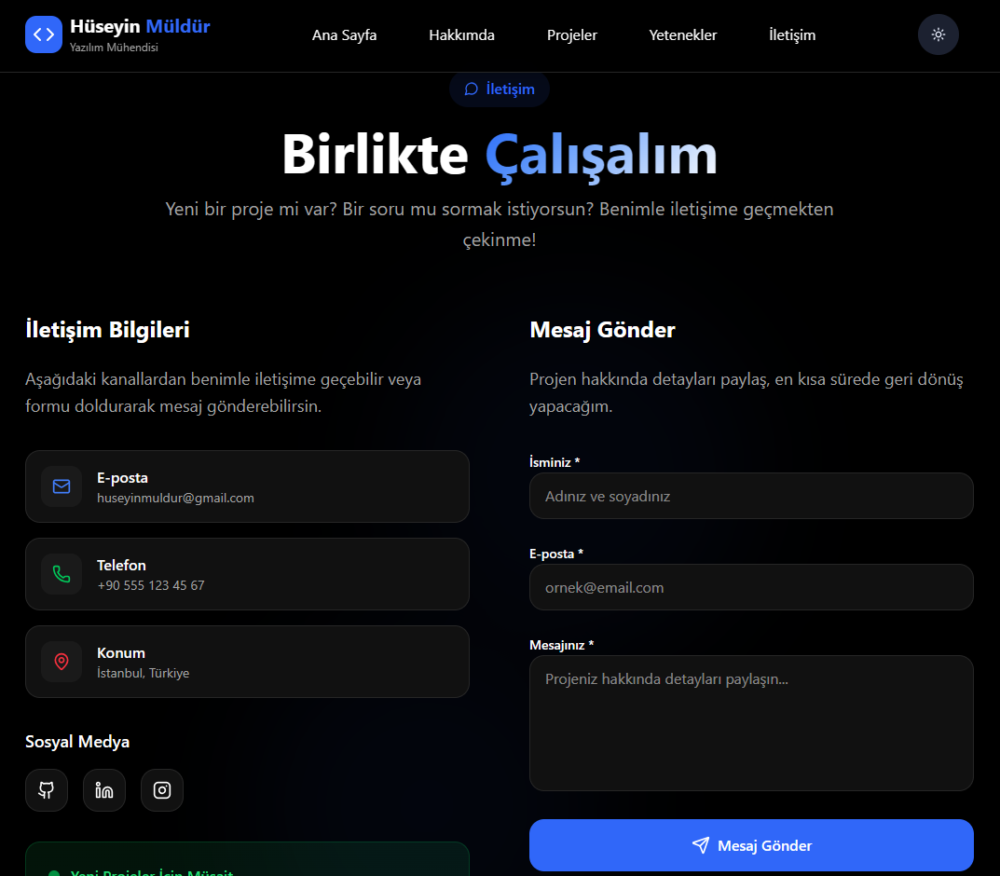
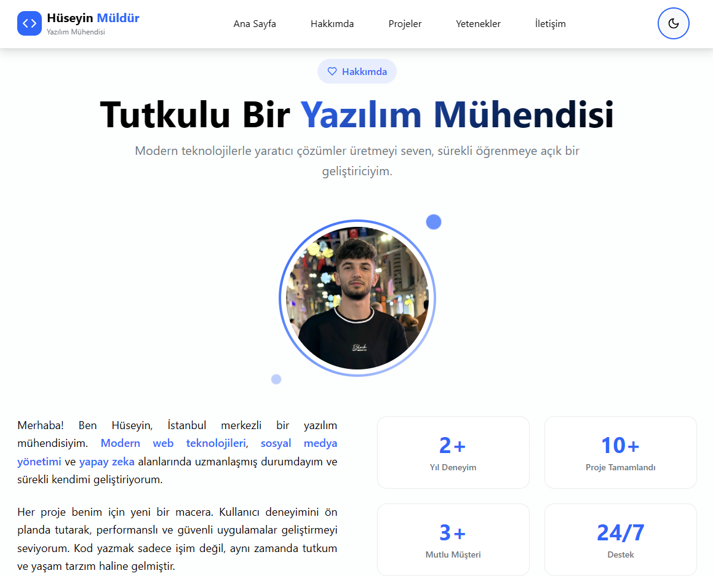

# 🚀 Hüseyin Portfolio - Modern Web Geliştirici Portfolyosu

Merhaba! Bu, modern web teknolojileri kullanılarak geliştirilmiş kişisel portfolio websitesidir. React, Vite, Tailwind CSS ve Framer Motion ile oluşturulmuş, responsive ve interaktif bir deneyim sunar.

## 🌟 Özellikler

### ✨ Modern Tasarım
- **Responsive Design**: Tüm cihazlarda mükemmel görünüm
- **Dark/Light Mode**: Kullanıcı tercihine göre tema değiştirme
- **Smooth Animations**: Framer Motion ile akıcı geçişler
- **Modern UI Components**: Radix UI ve shadcn/ui bileşenleri

### 🎯 Ana Bölümler
- **Hero Section**: Etkileyici giriş bölümü
- **Hakkımda**: Profil fotoğrafı ve detaylı tanıtım
- **Yetenekler**: Teknik beceriler ve uzmanlık alanları
- **Projeler**: Gerçekleştirilen çalışmaların sergilenmesi
- **İletişim**: Profesyonel iletişim formu

### 🛠️ Teknik Özellikler
- **React 19**: En güncel React sürümü
- **Vite**: Hızlı build ve geliştirme
- **Tailwind CSS 4**: Modern CSS framework
- **TypeScript Ready**: Tip güvenliği desteği
- **ESLint**: Kod kalitesi kontrolleri

## 📸 Ekran Görüntüleri

### 🏠 Ana Sayfa

*Modern ve etkileyici hero bölümü*

### 👨‍💻 Hakkımda Bölümü

*Profil fotoğrafı ve detaylı tanıtım*

### 💼 Projeler

*Gerçekleştirilen projelerin sergilendiği bölüm*

### 🎨 Yetenekler

*Teknik beceriler ve uzmanlık alanları

### 📞 İletişim

*Profesyonel iletişim formu*

### 🌙 Light Mode

*Aydınlık tema görünümü*


## 🚀 Kurulum ve Çalıştırma

### Gereksinimler
- Node.js (v18 veya üzeri)
- pnpm (önerilen) veya npm/yarn

### Adımlar

1. **Projeyi klonlayın:**
   ```bash
   git clone https://github.com/username/huseyin-portfolio-new.git
   cd huseyin-portfolio-new
   ```

2. **Bağımlılıkları yükleyin:**
   ```bash
   pnpm install
   # veya
   npm install
   ```

3. **Geliştirme sunucusunu başlatın:**
   ```bash
   pnpm dev
   # veya
   npm run dev
   ```

4. **Tarayıcınızda açın:**
   ```
   http://localhost:5173
   ```

## 📦 Build ve Deploy

### Production Build
```bash
pnpm build
# veya
npm run build
```

### Preview Build
```bash
pnpm preview
# veya
npm run preview
```

### Linting
```bash
pnpm lint
# veya
npm run lint
```

## 🛠️ Kullanılan Teknolojiler

### Frontend Framework
- **React 19** - Modern UI kütüphanesi
- **Vite** - Hızlı build tool
- **React Router DOM** - SPA routing

### Styling & UI
- **Tailwind CSS 4** - Utility-first CSS framework
- **Radix UI** - Headless UI primitives
- **shadcn/ui** - Modern component library
- **Lucide React** - Beautiful icons

### Animations & Interactions
- **Framer Motion** - Smooth animations
- **React Hook Form** - Form yönetimi
- **Zod** - Schema validation

### Development Tools
- **ESLint** - Code linting
- **TypeScript Ready** - Type safety
- **Vite Plugins** - Development experience

## 📱 Responsive Tasarım

Website, tüm cihaz boyutlarında mükemmel çalışacak şekilde tasarlanmıştır:

- 📱 **Mobile**: 320px - 768px
- 📟 **Tablet**: 768px - 1024px
- 🖥️ **Desktop**: 1024px ve üzeri
- 📺 **Large Screens**: 1440px ve üzeri

## 🎨 Tema Sistemi

- **Light Mode**: Aydınlık ve modern görünüm
- **Dark Mode**: Göz dostu karanlık tema
- **System**: Sistem tercihine göre otomatik

## 🔧 Özelleştirme

### Renkler
Tailwind CSS yapılandırmasında tema renklerini değiştirebilirsiniz:
```css
:root {
  --primary: /* Ana renk */;
  --accent: /* Vurgu rengi */;
  --background: /* Arkaplan rengi */;
}
```

### İçerik
Bileşenlerdeki metinleri ve bilgileri kendi içeriğinizle değiştirebilirsiniz.

## 📊 Performans

- ⚡ **Lighthouse Score**: 95+ (Performance)
- 🎯 **SEO Optimized**: Meta tags ve semantic HTML
- 🚀 **Fast Loading**: Vite optimizasyonları
- 📱 **Mobile First**: Responsive design

## 🤝 Katkıda Bulunma

1. Fork edin
2. Feature branch oluşturun (`git checkout -b feature/amazing-feature`)
3. Değişikliklerinizi commit edin (`git commit -m 'Add amazing feature'`)
4. Branch'inizi push edin (`git push origin feature/amazing-feature`)
5. Pull Request oluşturun

## 📄 Lisans

Bu proje MIT lisansı altında lisanslanmıştır. Detaylar için [LICENSE](LICENSE) dosyasına bakınız.

## 📞 İletişim

**Hüseyin** - Yazılım Mühendisi

- 💼 **LinkedIn**: [linkedin.com/in/huseyin](https://linkedin.com/in/huseyin)
- 🐙 **GitHub**: [github.com/huseyin](https://github.com/huseyin)
- 📧 **Email**: huseyin@example.com
- 🌐 **Website**: [huseyinportfolio.com](https://huseyinportfolio.com)

---

⭐ Bu projeyi beğendiyseniz yıldız vermeyi unutmayın!

## 🔄 Güncellemeler

### v1.0.0 (2025-09-19)
- ✨ İlk sürüm yayınlandı
- 🎨 Modern tasarım tamamlandı
- 📱 Responsive design eklendi
- 🌙 Dark mode desteği
- ⚡ Performance optimizasyonları

---

**© 2025 Hüseyin Portfolio. Tüm hakları saklıdır.**
